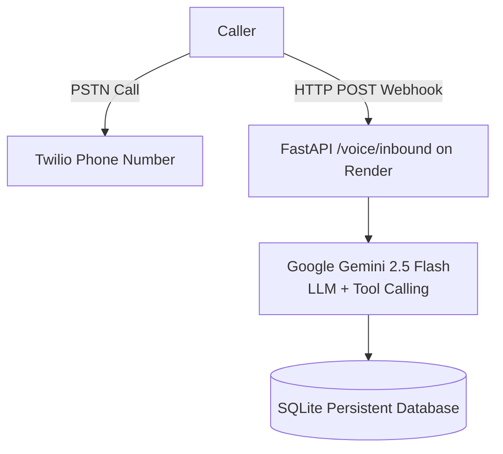

# Voice AI Patient Registration System (Twilio + Gemini API)

A custom, voice-activated Patient Registration Assistant built using **Twilio Voice Webhooks**, **Google Gemini 2.5 Flash**, and a **FastAPI** backend with **SQLite** storage deployed on **Render**.

> **Note on Project Status:** This repository contains the primary codebase built during the CareCloud AI Engineer Technical Assessment[cite: 1, 2]. Due to external vendor verification/regulatory restrictions on the Twilio trial account that prevented inbound call routing during live testing[cite: 2], the telephony orchestration layer was pivoted to complete the live demonstration[cite: 2]. This repository serves as complete proof of architecture, prompt engineering, tool definitions, and backend implementation for the original Twilio + Gemini setup.

---

## 🏗️ System Architecture



1. **Telephony Handling:** Twilio Voice webhooks process inbound calls and handle continuous dialogue streams using dynamic TwiML (`<Gather>` and `<Say>`).
2. **Conversational Brain:** Google Gemini 2.5 Flash manages natural dialogue, handles edge-case corrections, and executes structured tool/function calls (`check_caller_registered`, `save_patient_record`).
3. **Validation & Deployment:** FastAPI with Pydantic schemas enforces strict server-side demographic constraints before persisting data to SQLite[cite: 2, 3], deployed live on Render.

---

## ✨ Features Implemented

- 🟢 **Natural Voice Interaction:** Dynamic conversational intake collecting standard U.S. patient demographic fields[cite: 2, 3].
- 🟢 **Server-Side Validation:** Enforces valid 10-digit U.S. phone numbers, 2-letter state abbreviations, valid ZIP codes, and prevents future dates of birth[cite: 2, 3].
- 🟢 **Function Calling / Tools:** Native Gemini tool definitions for checking caller existence and saving confirmed records.
- 🟢 **Recap & Confirmation:** Explicitly reads back all collected fields for verbal confirmation before saving[cite: 2, 3].
- 🟢 **RESTful API & CRUD:** Full `/patients` REST API supporting retrieval, filtering, creation, updating, and soft deletion (`deleted_at`)[cite: 2, 3].

---

## 🛠️ Tech Stack

| Layer                    | Technology                               |
| :----------------------- | :--------------------------------------- |
| **Telephony**            | Twilio Voice Webhooks (TwiML)            |
| **LLM & Tool Calling**   | Google Gemini 2.5 Flash (`google-genai`) |
| **Backend Framework**    | Python / FastAPI                         |
| **Validation**           | Pydantic v2                              |
| **Database**             | SQLite (Relational Storage)[cite: 2, 3]  |
| **Hosting & Deployment** | Render                                   |

---

## ⚙️ Environment Variables

Create a `.env` file in the root directory or configure in Render Dashboard:

```env
GOOGLE_API_KEY=your_gemini_api_key_here
HOST_URL=[https://your-app-name.onrender.com](https://your-app-name.onrender.com)
DATABASE_URL=sqlite:///./patients.db
TWILIO_ACCOUNT_SID=your_twilio_sid
TWILIO_AUTH_TOKEN=your_twilio_auth_token
```

## 🚀 Setup & Deployment

### Local Development

```bash
# Clone the repository
git clone <your-twilio-repo-url>
cd <your-twilio-repo-folder>

# Create and activate virtual environment
python -m venv venv
source venv/bin/activate  # On Windows: venv\Scripts\activate

# Install dependencies
pip install -r requirements.txt

# Run server
uvicorn app.main:app --reload --port 8000
```
> Interactive Swagger API documentation is available at `http://127.0.0.1:8000/docs`.

---

### Deploying to Render

1. Push this repository to GitHub.
2. Create a new **Web Service** on **Render** linked to this repository.
3. Set **Runtime** to **Docker** (or Python 3.11).
4. Add environment variables (`GOOGLE_API_KEY`, etc.).
5. Configure your Twilio Phone Number's Inbound Voice Webhook URL to:  
   `https://<your-app-name>.onrender.com/voice/inbound` (**HTTP POST**)

---

## ⚠️ Known Issue / Blocker

- **Carrier Verification Restriction:** Inbound call routing was restricted by Twilio trial account regulatory checks (A2P 10DLC / identity approval requirement), preventing the webhooks from receiving live PSTN connections during the final evaluation window.
